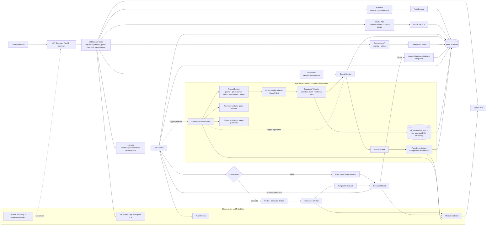
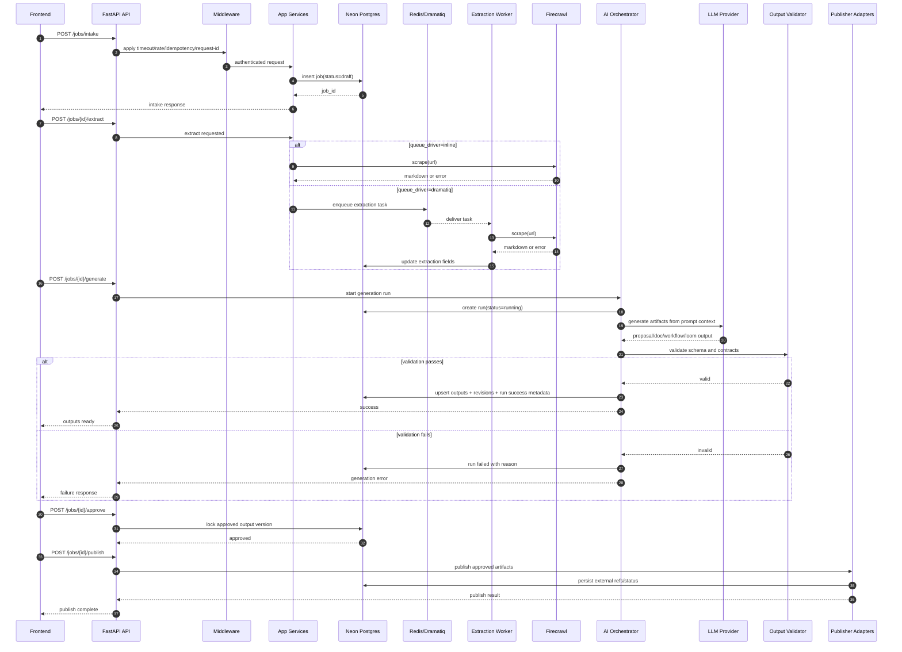
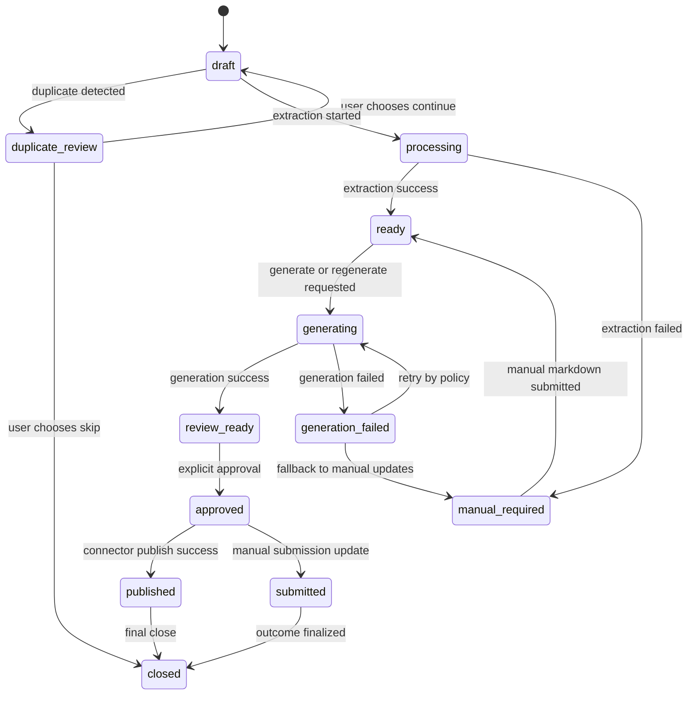
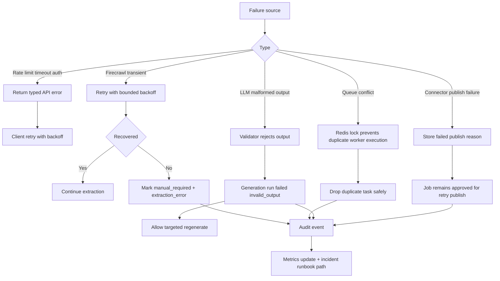
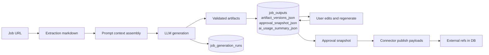

# Backend Full Pipeline Mermaid (Current + Target AI)

Last Updated: 2026-04-03  
Scope: Production-level backend flow from request entry to AI generation, approval, and publishing.

This document combines:
1. Existing backend (already implemented).
2. AI orchestration layers (remaining scope to implement).
3. End-to-end pipeline behavior including retries, fallbacks, state transitions, and observability.

---

## 1) System Architecture (Implemented + Planned)



---

## 2) End-to-End Execution Pipeline (Detailed)

```mermaid
flowchart TD
    A1[Client sends request\nPOST /api/v1/jobs/intake] --> A2[Middleware validates\ntimeout, rate limit, idempotency]
    A2 --> A3{Auth session cookie valid}
    A3 -->|No| A4[Return 401]
    A3 -->|Yes| A5[Normalize URL + parse Upwork job id]

    A5 --> A6{Duplicate exists for same user}
    A6 -->|Yes| A7[Return duplicate decision required]
    A6 -->|No| A8[Create job row status=draft]

    A8 --> A9[Client triggers extraction\nPOST /jobs/{id}/extract]
    A9 --> A10{QUEUE_DRIVER}

    A10 -->|inline| A11[Run extraction in request path]
    A10 -->|dramatiq| A12[Enqueue extraction task]
    A12 --> A13[Worker pulls task]
    A13 --> A14[Acquire Redis lock per job]
    A14 --> A15{Lock acquired}
    A15 -->|No| A16[Skip duplicate concurrent task]
    A15 -->|Yes| A17[Call Firecrawl scrape API]

    A11 --> A17
    A17 --> A18{Firecrawl success}
    A18 -->|No| A19[Mark job requires_manual_markdown=true\nstore extraction_error]
    A18 -->|Yes| A20[Store job_markdown + notes_markdown\nstatus=ready]

    A19 --> A21[User posts manual markdown\nPOST /jobs/{id}/manual-markdown]
    A21 --> A22[Store markdown\nstatus=ready]
    A20 --> B1
    A22 --> B1

    B1[Generation entrypoint\nPOST /jobs/{id}/generate] --> B2[Create generation run record\nstatus=running]
    B2 --> B3[Build prompt context\nprofile + templates + job markdown + custom blocks]
    B3 --> B4[Apply budget and quota policy checks]
    B4 --> B5{Policy allows run}
    B5 -->|No| B6[Fail run with reason quota or policy]
    B5 -->|Yes| B7[Call LLM provider adapter]

    B7 --> B8{LLM response valid}
    B8 -->|No| B9[Retry transient errors by policy]
    B9 --> B10{Retry exhausted}
    B10 -->|No| B7
    B10 -->|Yes| B11[Fail run\nstore failure reason]

    B8 -->|Yes| B12[Validate deterministic schemas\nworkflow JSON contract]
    B12 --> B13{Schema valid}
    B13 -->|No| B14[Fail run as invalid_output]
    B13 -->|Yes| B15[Persist outputs\nproposal + loom + doc + workflows]

    B15 --> B16[Create output revision records]
    B16 --> B17[Mark generation run success\nstore tokens, latency, model, cost]
    B17 --> B18[Job status=ready_for_review]

    B18 --> C1[User reviews and edits outputs]
    C1 --> C2{Need targeted regenerate}
    C2 -->|Yes| C3[POST /jobs/{id}/outputs/{type}/regenerate]
    C3 --> C4[Run same orchestration for one output type]
    C4 --> C5[Append edit log + revision]
    C2 -->|No| C6[Proceed to approval]
    C5 --> C6

    C6 --> C7[POST /jobs/{id}/approve]
    C7 --> C8[Freeze approved output set]
    C8 --> C9[Job status=approved]

    C9 --> D1[Publish step by connector adapters]
    D1 --> D2{Google Docs connected}
    D2 -->|Yes| D3[Publish doc and store external URL]
    D2 -->|No| D4[Skip docs publish with reason]

    D3 --> D5{Airtable connected}
    D4 --> D5
    D5 -->|Yes| D6[Push record fields and status]
    D5 -->|No| D7[Skip Airtable publish with reason]

    D6 --> D8[Mark submission metadata]
    D7 --> D8
    D8 --> D9[PATCH /jobs/{id}/submission]
    D9 --> D10[Job status=submitted or closed]

    B6 --> Z1[Audit event + metrics + alert rules]
    B11 --> Z1
    B14 --> Z1
    D10 --> Z2[History API serves final lifecycle]
```

---

## 3) Async Sequence (Request, Queue, AI, and Publish)



---

## 4) Job Lifecycle State Machine (Target)



---

## 5) Failure and Recovery Control Flow



---

## 6) Data Lineage (From Input to Final Artifacts)



---

## 7) Implementation Mapping (Phase-to-Diagram)

1. Implemented now:
- API/middleware/auth/profile/job/output/connector/history.
- Firecrawl extraction + manual fallback.
- Queue worker plumbing and reliability controls.

2. Next (B13-B16):
- AI orchestrator + OpenAI adapter + validator + generation run tables.
- Generate/regenerate/approve APIs.
- Connector publish adapters and health probes.
- Cost controls, safety guardrails, AI integration tests.

